# 🍞 Dough — Creative Agency Website

A modern, bilingual portfolio website built for **Dough**, a Cairo-based creative agency shaping brands, stories, and cultural moments from scratch. The platform presents the agency’s philosophy, six core service disciplines, featured client work, and multi-step contact flows through a bold, animation-rich experience aligned with Dough’s brand identity — _where ideas take shapes._

The site strengthened Dough’s digital presence with a scroll-stopping hero, structured case studies for **6 client brands**, and a fully localized English/Arabic experience with RTL support — giving prospects a clear view of services, portfolio depth, and how to start a project or join the team.

---

## 🔧 Features

### 🏠 Homepage & Brand Story

- Animated hero with bold typography and primary CTAs
- Who We Are, What We Bake, Featured Works, How We Work, and Why Us sections
- Custom baking-themed page loader and smooth navigation transitions
- GSAP-powered motion and scroll-driven interactions

### 💼 Work & Case Studies

- Dedicated Work page with client logo carousel and project highlights
- Individual case study pages per client (Akleh, LUX, HNDL, Farooja, Knorr, Kufta)
- Challenge / approach / outcome storytelling with image galleries
- Localized project copy in English and Arabic

### 🌍 Multilingual Experience

- Full English and Arabic support via `next-intl`
- RTL / LTR layout compatibility with Alexandria + Montserrat typography
- Globe language toggle in the navigation bar
- Localized API responses for contact form errors

### 📬 Contact & Careers

- **Start a Project** — 3-step inquiry form for new business
- **Join the Team** — careers form with resume upload
- Direct links to Instagram, WhatsApp, and Cairo office address
- Server-side email delivery through API routes

### 🧑‍🍳 Uncle Dough

- Dedicated coming-soon landing page for the Uncle Dough sub-brand

---

## 💡 Impact

- Delivered a premium agency portfolio that reflects Dough’s playful yet strategic brand voice
- Showcased **6 client case studies** across QSR, FMCG, and lifestyle sectors
- Enabled bilingual outreach for both local and international prospects
- Streamlined lead capture with structured project and hiring inquiry flows

---

## 📦 Tech Stack

| Layer       | Tech                               |
| ----------- | ---------------------------------- |
| Framework   | Next.js 16, React 19, TypeScript   |
| i18n        | next-intl (English / Arabic)       |
| Styling     | Tailwind CSS 4                     |
| Animation   | GSAP                               |
| Forms & API | Next.js Route Handlers, Nodemailer |
| Analytics   | Vercel Analytics                   |
| Deployment  | Vercel                             |

---

## 🌐 Deployment Notes

- Fully responsive design (desktop, tablet, mobile)
- Optimized fonts via `next/font` (Montserrat + Alexandria)
- Environment-based email configuration for contact submissions
- Production-ready static generation for portfolio and case study pages

---

## 📸 Screenshots

- Hero Section
  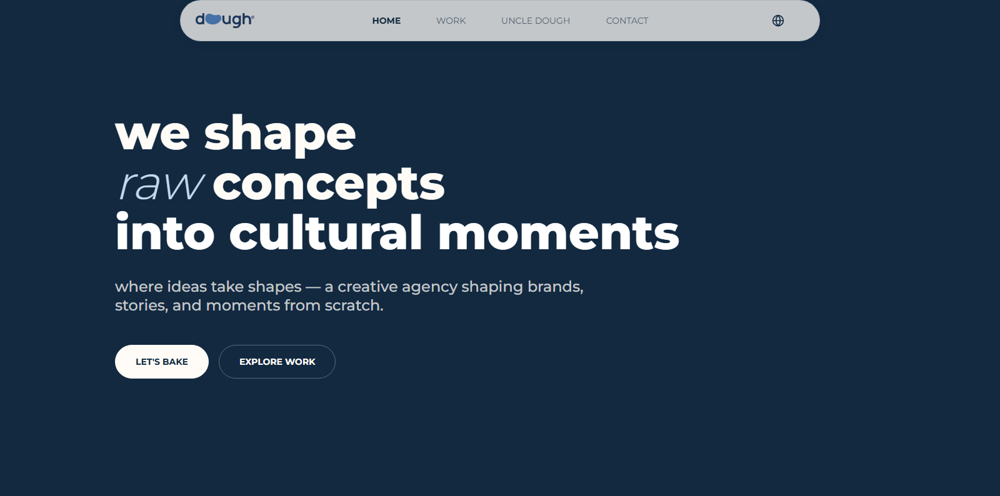

- Mobile Preview
  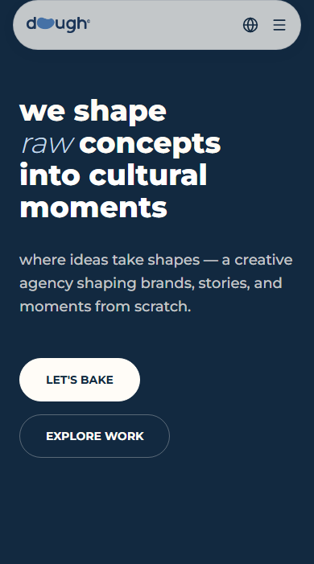

- Who We Are
  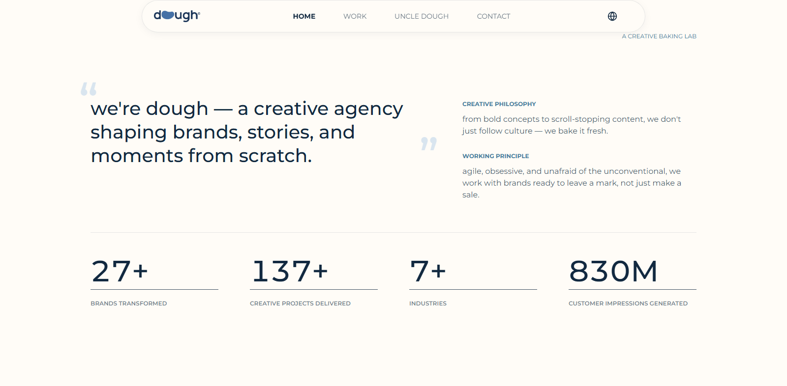

- What We Bake
  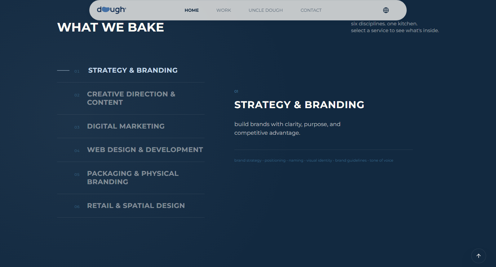

- Featured Works
  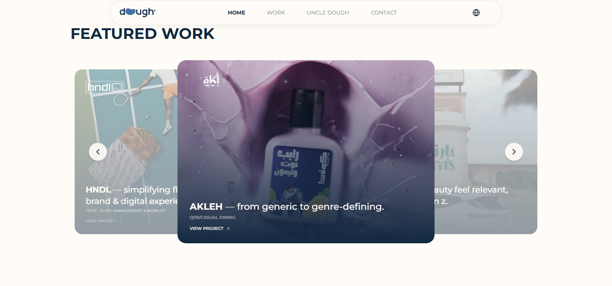

- How We Work
  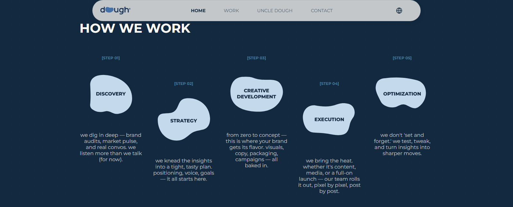

- Work Portfolio
  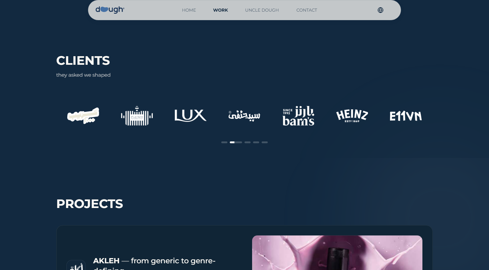

- Case Study — Akleh
  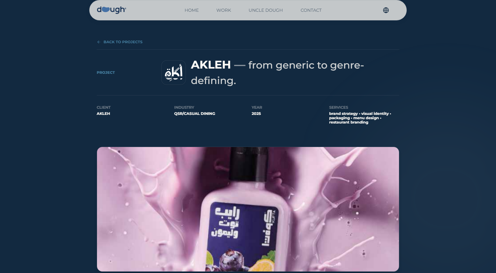

- Case Study Overview
  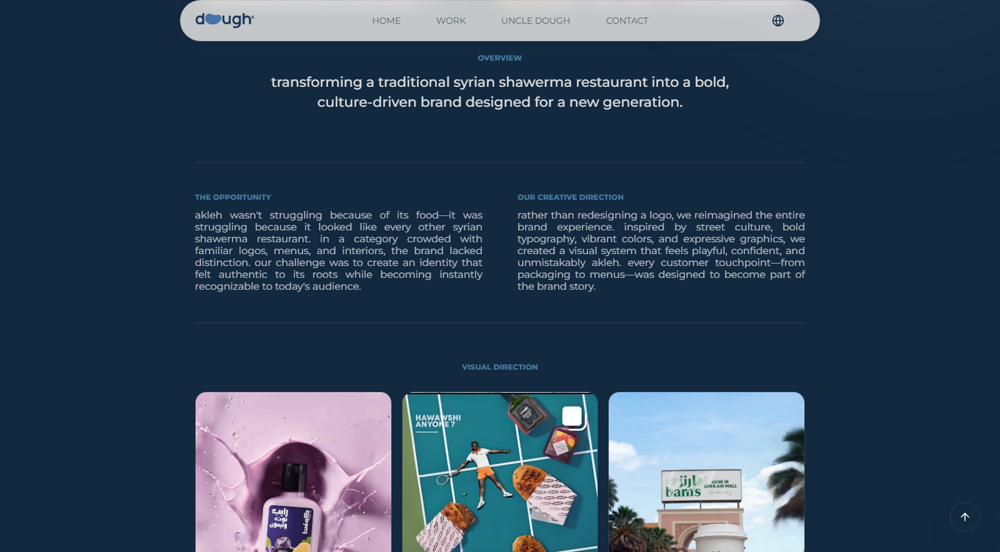

- Contact Page
  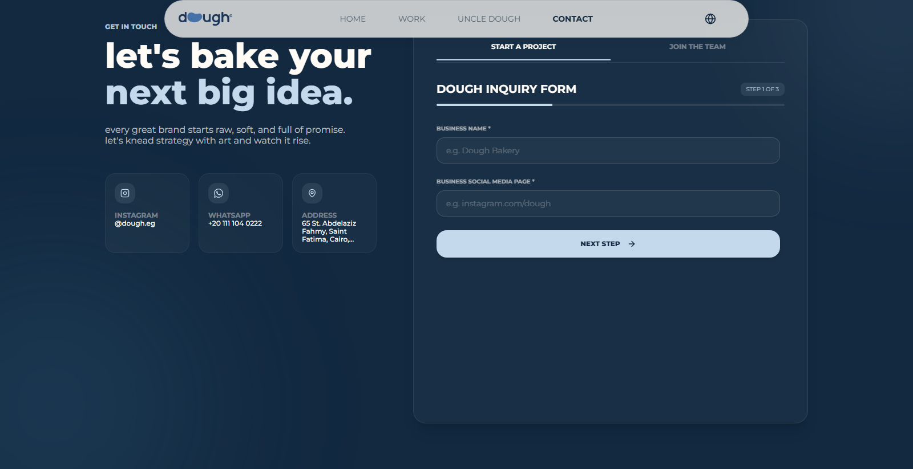

- Uncle Dough
  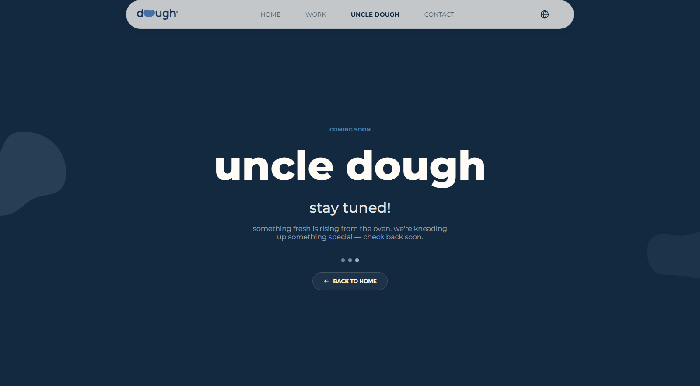

- Arabic Homepage
  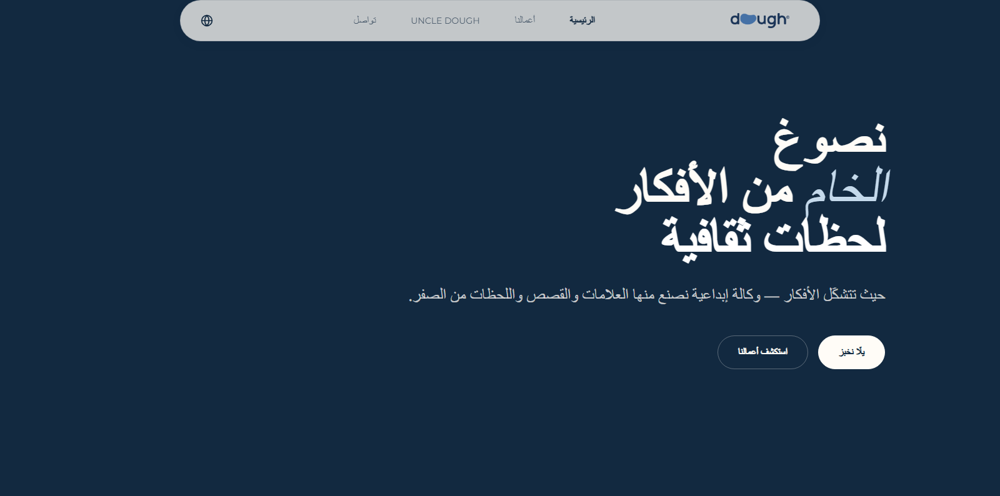

## Live Demo 🚀

[**View Live Demo**](https://dough.vercel.app/)

---

## Author

👤 **Omar Mahmoud**
📧 [omrmhd54@gmail.com](mailto:omrmhd54@gmail.com)
💼 [LinkedIn](https://www.linkedin.com/in/omrmhd5/)
🌐 [Portfolio](https://omarmahmoud.dev/)
🔗 [GitHub](https://github.com/omrmhd5)
